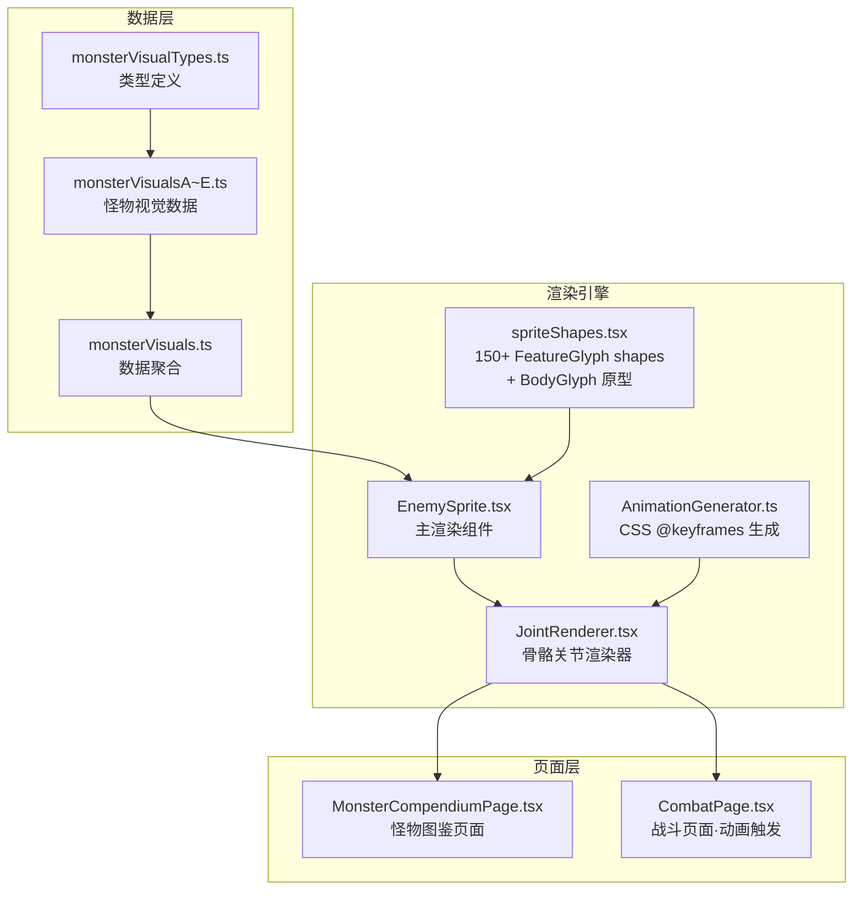

# Design Document: Monster Visual Overhaul

## Overview

本设计为 roguelike-card-game 的怪物视觉系统进行四大维度升级：

1. **外貌特征细化** — 每只怪物从现有 5-8 个特征提升至 7-9 个，确保视觉独特性
2. **体型缩放差异化** — size 范围扩展至 0.5–1.8，配合 Ground_Line 对齐机制
3. **骨骼关节动画系统** — 6 关节骨骼树 + 6 种动画片段（纯 CSS @keyframes 驱动）
4. **怪物图鉴页面** — 按 25 地域分组展示，含动画预览控制

所有改动基于现有 TypeScript + React + 纯 SVG 技术栈，向后兼容现有 MonsterVisualSpec 接口和 EnemySprite 组件。

### 核心设计原则

- **纯增量扩展**：仅 additive 修改类型接口，不破坏现有数据
- **纯 CSS 动画**：禁止 JS 动画库，利用浏览器合成线程性能
- **数据驱动**：动画和关节均为纯数据结构，可序列化/测试
- **渐进兼容**：没有 joints 字段的怪物仍然正常静态渲染

---

## Architecture



### 数据流

1. `MonsterVisualSpec` 包含新增 `joints` 和 `animations` 字段
2. `EnemySprite` 接收 `animation` prop → 查找对应 `AnimationClip`
3. `AnimationGenerator` 将 clip 数据转为 CSS `@keyframes` 字符串
4. 通过内联 `<style>` 注入 SVG → 驱动关节 transform 动画
5. 动画结束后触发 `onAnimationEnd` 回调

---

## Components and Interfaces

### 1. 扩展类型系统 (monsterVisualTypes.ts)

```typescript
// ─── 新增：关节定义 ───
export interface JointDef {
  id: string;            // 关节唯一标识：'root' | 'head' | 'armL' | 'armR' | 'legL' | 'legR' 等
  parentId: string | null;  // 父关节 ID，root 为 null
  anchor: { x: number; y: number };  // Sprite_Canvas 坐标系中的锚点
  boundFeatures: number[];  // 绑定的 features 数组索引
}

// ─── 新增：动画关键帧 ───
export interface JointKeyframe {
  jointId: string;
  rotation?: number;    // 相对于静止态的旋转角度（度）
  translateX?: number;  // 相对于锚点的位移
  translateY?: number;
}

export interface AnimationKeyframe {
  time: number;          // 0-1 归一化时间偏移
  joints: JointKeyframe[];
  easing?: 'linear' | 'ease-in' | 'ease-out' | 'ease-in-out';
}

export interface AnimationClip {
  name: string;          // 'hit' | 'attack1' | 'attack2' | 'attack3' | 'skill1' | 'skill2'
  duration: number;      // 毫秒
  keyframes: AnimationKeyframe[];
}

// ─── 扩展现有接口 ───
export interface MonsterVisualSpec {
  // 保留原有字段
  kind: BodyKind;
  hue: string;
  hue2: string;
  glow: string;
  size: number;
  eye: EyeStyle;
  features: FeatureSpec[];
  // 新增可选字段
  joints?: JointDef[];       // 6 个关节定义
  animations?: AnimationClip[];  // 6 个动画片段
}
```

### 2. EnemySprite 组件扩展

```typescript
// EnemySprite.tsx 新增 props
interface EnemySpriteProps {
  id: string;
  label?: string;
  size?: number;
  animate?: boolean;
  // 新增
  animation?: string;            // 触发的动画片段名称
  onAnimationEnd?: () => void;   // 动画完成回调
}
```

**渲染逻辑变更**：

```typescript
export default function EnemySprite({ id, size = 180, animate = true, animation, onAnimationEnd }: EnemySpriteProps) {
  const spec = resolveEnemyVisualSpec(id);
  if (!spec) return <FallbackSprite size={size} label={id} />;

  const tier = enemyTier(id);
  const sizeScale = spec.size;  // 应用 MonsterVisualSpec.size
  const hasJoints = spec.joints && spec.joints.length === 6;

  // Ground_Line 对齐计算
  const groundY = 103;  // 阴影椭圆中心
  const offsetY = (1 - sizeScale) * groundY;

  return (
    <svg viewBox="0 0 120 120" width={size} height={size} role="img" aria-label={id}>
      {/* ... 背景光环、tier 装饰 ... */}
      <ellipse cx={60} cy={103} rx={27 * sizeScale} ry={4.4} fill="#000" opacity={0.42} />
      <g transform={`translate(${60 * (1 - sizeScale)} ${offsetY}) scale(${sizeScale})`}
         className={!animation && animate ? 'enemy-idle' : undefined}>
        {hasJoints && animation
          ? <JointRenderer spec={spec} animation={animation} onEnd={onAnimationEnd} />
          : <StaticRenderer spec={spec} gid={gid} />
        }
      </g>
      {hasJoints && animation && <AnimationStyle spec={spec} clipName={animation} instanceId={gid} />}
    </svg>
  );
}
```

### 3. JointRenderer 组件 (新文件)

```typescript
// src/components/enemies/JointRenderer.tsx
interface JointRendererProps {
  spec: MonsterVisualSpec;
  animation: string;
  onEnd?: () => void;
}

export function JointRenderer({ spec, animation, onEnd }: JointRendererProps) {
  // 将 features 按 joint 绑定分组
  // 每个关节渲染为一个 <g> 带有 CSS animation 引用
  // 未绑定的 features 直接渲染（不受关节驱动）
}
```

**骨骼树渲染策略**：

```
root (body/torso)
├── head
│   ├── features bound to head
├── armL
│   ├── features bound to armL
├── armR
│   ├── features bound to armR
├── legL
│   ├── features bound to legL
└── legR
    └── features bound to legR
```

每个关节的 `<g>` 元素使用 `transform-origin` 设为锚点坐标，CSS animation 驱动 `transform: rotate() translate()` 变换。子关节嵌套在父关节 `<g>` 内，自动继承父变换。

### 4. AnimationGenerator (新文件)

```typescript
// src/components/enemies/animationGenerator.ts
export function generateKeyframes(
  clip: AnimationClip,
  joints: JointDef[],
  instanceId: string
): string {
  // 为每个关节生成独立的 @keyframes 规则
  // 输出: `@keyframes ${instanceId}-${jointId} { 0% {...} 50% {...} 100% {...} }`
  // 关键帧中的 easing 通过 animation-timing-function 实现
}

export function generateAnimationCSS(
  clip: AnimationClip,
  joints: JointDef[],
  instanceId: string
): string {
  // 生成完整的 <style> 内容
  // 包含 @keyframes 定义 + .joint-${id} { animation: ... } 规则
}
```

**CSS 输出示例**：

```css
@keyframes esg-kilnbrute-root {
  0% { transform: rotate(0deg) translate(0px, 0px); }
  40% { transform: rotate(-3deg) translate(-2px, 0px); }
  100% { transform: rotate(0deg) translate(0px, 0px); }
}
.esg-kilnbrute-root {
  animation: esg-kilnbrute-root 600ms ease-in-out forwards;
  transform-origin: 60px 65px;
}
```

### 5. spriteShapes.tsx 扩展

**目标**：从 144 个 shape 函数扩展至 150+ 个

**新增语义分类**：

| 类别 | 现有数量 | 需新增 | 示例 |
|------|---------|--------|------|
| anatomy (身体) | ~25 | +3 | `tongue`, `ribcage`, `tendons` |
| weapons (武器) | ~15 | +1 | `flail` |
| armor (防具) | ~8 | +1 | `pauldron` |
| nature (自然) | ~20 | +0 | (已充足) |
| magic (魔法) | ~12 | +1 | `pentagram` |
| tech (科技) | ~10 | +1 | `antenna` |
| structural (建筑) | ~12 | +0 | (已充足) |
| effects (特效) | ~20 | +0 | (已充足) |
| misc (其它) | ~22 | +0 | (已充足) |

新增 shape 函数遵循现有模式：`(f: FeatureSpec) => JSX.Element`，返回 SVG `<g>` 元素。

`FeatureGlyph` 调度器新增对应的 `has()` 匹配规则。

### 6. 怪物数据文件组织

将现有 `monsterVisualsA.ts` / `monsterVisualsB.ts` 拆分为按地域分组的文件：

```
src/game/enemies/
├── monsterVisualTypes.ts      (类型)
├── monsterVisuals.ts          (聚合导出)
├── monsterVisualsA.ts         (灰烬荒原 + 落败村庄 + 生机森林)
├── monsterVisualsB.ts         (苔藓沼泽 + 恶臭下水道 + 繁华皇都)
├── monsterVisualsC.ts         (皇都外环 + 血色之地 + 魔法之地)
├── monsterVisualsD.ts         (科技之城 + 天空岛 + 贵族城堡 + 城堡地下墓道)
├── monsterVisualsE.ts         (冥界 + 幽冥渡口 + 海洋 + 亚特兰蒂斯)
├── monsterVisualsF.ts         (钟楼 + 荒漠 + 陨石遗迹)
├── monsterVisualsG.ts         (霓虹院 + 恶魔巢穴 + 世界地垒 + 旧日余响)
└── monsterAnimations.ts       (所有怪物的动画片段数据)
```

`monsterVisuals.ts` 聚合方式不变：

```typescript
export const MONSTER_VISUALS: Record<string, MonsterVisualSpec> = {
  ...VISUALS_A, ...VISUALS_B, ...VISUALS_C,
  ...VISUALS_D, ...VISUALS_E, ...VISUALS_F, ...VISUALS_G,
};
```

### 7. MonsterCompendiumPage 组件

```typescript
// src/pages/MonsterCompendiumPage.tsx
interface Props {
  onBack: () => void;
}

export function MonsterCompendiumPage({ onBack }: Props) {
  // 状态
  const [expandedMonster, setExpandedMonster] = useState<string | null>(null);
  const [playingClip, setPlayingClip] = useState<string | null>(null);

  // 按 REGIONS 顺序分组，使用 IntersectionObserver 懒加载
  // 每个 region section 仅在可见时渲染怪物卡片列表
}
```

**页面结构**：

```
MonsterCompendiumPage
├── Header (标题 + 返回按钮)
├── RegionSection × 25 (懒加载)
│   ├── RegionHeader (中文名 / 英文名 / hue 色条)
│   └── MonsterGrid
│       └── MonsterCard × N
│           ├── EnemySprite (120px 预览)
│           ├── 名称 + Tier 徽章
│           └── [展开] DetailPanel
│               ├── EnemySprite (240px)
│               └── AnimationControls (6 按钮)
```

**路由接入**：在 `App.tsx` 的 mode 分支中新增 `'monster-compendium'` mode，通过 `gameState.mode` 切换进入。

---

## Data Models

### 完整的 MonsterVisualSpec 示例（含 joints + animations）

```typescript
'kiln-brute': {
  kind: 'brute',
  hue: '#8a3f2a', hue2: '#4a2518', glow: '#ff6a45',
  size: 1.2, eye: 'red',
  features: [
    F('furnaceChest', 60, 58, '#ff6a45', 0, 1, '#2b1a10'),
    F('moltenCracks', 50, 66, '#e34325', 0, 0.9),
    F('ironFist', 30, 72, '#6f5a40', -8, 1.1),
    F('slagShoulderL', 38, 42, '#8a5a38', 12),
    F('slagShoulderR', 82, 42, '#8a5a38', -12),
    F('smokePlume', 60, 18, '#4a4a4a', 0, 0.8),
    F('ashFootL', 44, 96, '#3a2518', 0, 0.9),
    F('ashFootR', 76, 96, '#3a2518', 0, 0.9),
  ],
  joints: [
    { id: 'root', parentId: null, anchor: { x: 60, y: 65 }, boundFeatures: [0, 1] },
    { id: 'head', parentId: 'root', anchor: { x: 60, y: 35 }, boundFeatures: [5] },
    { id: 'armL', parentId: 'root', anchor: { x: 38, y: 50 }, boundFeatures: [2, 3] },
    { id: 'armR', parentId: 'root', anchor: { x: 82, y: 50 }, boundFeatures: [4] },
    { id: 'legL', parentId: 'root', anchor: { x: 44, y: 85 }, boundFeatures: [6] },
    { id: 'legR', parentId: 'root', anchor: { x: 76, y: 85 }, boundFeatures: [7] },
  ],
  animations: [
    {
      name: 'hit',
      duration: 400,
      keyframes: [
        { time: 0, joints: [], easing: 'ease-out' },
        { time: 0.3, joints: [
          { jointId: 'root', rotation: -5, translateX: -4 },
          { jointId: 'head', rotation: -8 },
        ]},
        { time: 1, joints: [] },
      ],
    },
    {
      name: 'attack1',
      duration: 600,
      keyframes: [
        { time: 0, joints: [] },
        { time: 0.2, joints: [{ jointId: 'armL', rotation: -30 }], easing: 'ease-in' },
        { time: 0.5, joints: [{ jointId: 'armL', rotation: 20 }, { jointId: 'root', translateX: 6 }], easing: 'ease-out' },
        { time: 1, joints: [] },
      ],
    },
    // ... attack2, attack3, skill1, skill2
  ],
}
```

### JointDef 约束

| 字段 | 约束 |
|------|------|
| `joints.length` | 恰好 6 |
| `parentId === null` | 恰好 1 个（root） |
| 无环 | 拓扑排序可达所有节点 |
| `boundFeatures` 索引 | 0 ≤ index < features.length |
| `anchor.x/y` | 0–120 范围 |

### Size 值语义对照

| 怪物类型 | size 范围 | 示例 |
|----------|-----------|------|
| tier-normal 小型 | 0.5–0.8 | plague-rat, glass-moth, bubble-eel |
| tier-normal 中型 | 0.85–1.0 | ashling, road-bandit, bell-acolyte |
| tier-elite 中大型 | 1.0–1.2 | kiln-brute, ancient-croc, storm-shepherd |
| tier-boss 大型 | 1.2–1.8 | crownless-furnace, world-ender, demon-progenitor |

### Ground_Line 对齐数学

```
groundY = 103 (shadow ellipse center)
scaledGroundY = groundY * sizeScale
offsetY = groundY - scaledGroundY = groundY * (1 - sizeScale)

// transform 应用：
transform = `translate(${60 * (1 - sizeScale)}, ${offsetY}) scale(${sizeScale})`
// 这将缩放中心对齐到画布水平中心，并锚定脚部到 groundY
```

对于 size < 1 的怪物，整体向下偏移使脚部仍在 ground line 上。
对于 size > 1 的怪物，整体向上偏移以腾出空间，头部可能超出 120×120 viewBox 但被 SVG clip 自然处理。

---

## Correctness Properties

*A property is a characteristic or behavior that should hold true across all valid executions of a system — essentially, a formal statement about what the system should do. Properties serve as the bridge between human-readable specifications and machine-verifiable correctness guarantees.*

### Property 1: Feature count invariant

*For any* monster in MONSTER_VISUALS, its `features` array SHALL have a length between 7 and 9 (inclusive).

**Validates: Requirements 1.1, 10.1**

### Property 2: Size field range invariant

*For any* monster in MONSTER_VISUALS, its `size` field SHALL be a number in the range [0.5, 1.8].

**Validates: Requirements 4.1, 10.2**

### Property 3: Joint tree structural validity

*For any* monster in MONSTER_VISUALS that has a `joints` field, the joints array SHALL have exactly 6 entries, contain exactly one root (parentId === null), have no cycles, and have all `boundFeatures` indices within bounds of the features array.

**Validates: Requirements 5.1, 5.2, 10.3**

### Property 4: Complete coverage invariant

*For any* monster ID present in REGION_OF, there SHALL exist a corresponding entry in MONSTER_VISUALS.

**Validates: Requirements 9.1, 10.4**

### Property 5: Intra-region shape uniqueness

*For any* two monsters within the same region, the set of their Feature_Spec shape IDs (the `s` field) SHALL share no more than 2 identical values.

**Validates: Requirements 1.4, 10.5**

### Property 6: Animation clip references valid joints

*For any* monster with animations, and *for any* keyframe in those animations, every `jointId` referenced SHALL either exist in the monster's joints array or be gracefully skipped (the animation system handles missing IDs without error).

**Validates: Requirements 6.4**

### Property 7: Size-tier consistency

*For any* tier-normal monster with size ∈ [0.5, 1.0], *for any* tier-elite monster with size ∈ [1.0, 1.2], and *for any* tier-boss monster with size ∈ [1.2, 1.8], the size value SHALL fall within the expected tier range.

**Validates: Requirements 4.5**

### Property 8: Ground_Line alignment idempotence

*For any* valid size value, applying the ground-line offset formula `offsetY = 103 * (1 - size)` SHALL produce a transform such that the scaled bottom of the sprite (y=103 after scale) remains at y=103 in canvas coordinates.

**Validates: Requirements 4.4**

---

## Error Handling

### 渲染降级策略

| 场景 | 处理方式 |
|------|----------|
| `spec` 不存在 | 渲染占位 fallback (现有行为保留) |
| `spec.joints` 未定义或 ≠ 6 | 忽略动画请求，按静态模式渲染 |
| `animation` prop 指向不存在的 clip | 忽略，保持 idle 动画 |
| AnimationClip 引用不存在的 jointId | 跳过该 joint 的关键帧，不报错 |
| CSS @keyframes 生成失败 | 抛出错误（不 fallback），通过 Error Boundary 捕获 |
| size 值越界（dev build） | console.warn 提示，仍按传入值渲染 |
| features 数量 < 7（dev build） | console.error 标记数据验证错误 |
| features 数量 < 7（prod build） | 正常渲染现有 features |

### 开发时验证 (dev only)

```typescript
if (import.meta.env.DEV) {
  if (spec.features.length < 7) {
    console.error(`[EnemySprite] ${id}: only ${spec.features.length} features (minimum 7)`);
  }
  if (spec.size < 0.5 || spec.size > 1.8) {
    console.warn(`[EnemySprite] ${id}: size ${spec.size} outside expected range [0.5, 1.8]`);
  }
}
```

---

## Testing Strategy

### 属性测试 (Property-Based Testing)

使用 [fast-check](https://github.com/dubzzz/fast-check) 作为 PBT 库（与项目现有 vitest 生态兼容）。

**配置**：
- 每个 property test 最少运行 100 次迭代
- 每个 test 以注释标注对应的 design property
- 标签格式: `Feature: monster-visual-overhaul, Property {N}: {description}`

**Property test 文件**: `tests/monsterVisualProperties.test.ts`

```typescript
import fc from 'fast-check';
import { MONSTER_VISUALS, REGION_OF, enemyTier } from '../src/game/enemies/monsterVisuals';

// Feature: monster-visual-overhaul, Property 1: Feature count invariant
test.each(Object.entries(MONSTER_VISUALS))('%s has 7-9 features', (id, spec) => {
  expect(spec.features.length).toBeGreaterThanOrEqual(7);
  expect(spec.features.length).toBeLessThanOrEqual(9);
});

// Property 3 使用 fast-check 对 joint tree 结构做 exhaustive 验证
```

### 单元测试

| 测试目标 | 类型 | 文件 |
|----------|------|------|
| AnimationGenerator 输出格式 | unit | tests/animationGenerator.test.ts |
| Ground_Line offset 计算 | unit | tests/spriteRendering.test.ts |
| JointRenderer 嵌套结构 | unit | tests/jointRenderer.test.ts |
| FeatureGlyph dispatch 覆盖 | unit | tests/spriteShapes.test.ts |
| MonsterCompendiumPage 渲染 | integration | tests/compendium.test.ts |

### 集成测试

- 扩展现有 `tests/contentAppearance.test.ts`，验证所有 180+ 怪物可 `renderToStaticMarkup` 无错误
- 新增 e2e test 验证图鉴页面可正常进入和滚动

### 构建验证

- `npm run typecheck` 零 TypeScript 错误
- `npm run build` 无警告
- `npm run test` 所有 property tests 通过

---

## Integration Points

### 战斗系统动画触发

`CombatPage.tsx` 在以下时机传递 `animation` prop 给 `EnemySprite`：

```typescript
// 敌人受击
<EnemySprite id={enemy.id} animation={isHit ? 'hit' : undefined} onAnimationEnd={clearHitState} />

// 敌人攻击（根据 intent.type 选择 attack1/2/3）
<EnemySprite id={enemy.id} animation={attacking ? `attack${variant}` : undefined} onAnimationEnd={advanceTurn} />

// 敌人释放技能
<EnemySprite id={enemy.id} animation={castingSkill ? `skill${variant}` : undefined} onAnimationEnd={advanceTurn} />
```

### 图鉴页面接入

在 `useGameStore` 中新增 `openMonsterCompendium` action，设置 `gameState.mode = 'monster-compendium'`。

`App.tsx` 新增分支：
```typescript
else if (gameState.mode === 'monster-compendium')
  page = <MonsterCompendiumPage onBack={() => store.openMonsterCompendium(false)} />;
```

从首页或现有图鉴页面提供入口链接。

### 性能策略

1. **图鉴虚拟化**：使用 `IntersectionObserver` 仅渲染视口内的 region section
2. **CSS 动画离线**：@keyframes 在首次触发时生成并缓存，不每帧重新计算
3. **合成线程**：所有动画仅操作 `transform` 和 `opacity`，确保 GPU 加速
4. **战斗上限**：同屏最多 4 个怪物，每个怪物的 SVG 复杂度控制在 ~50 个 DOM 节点内

